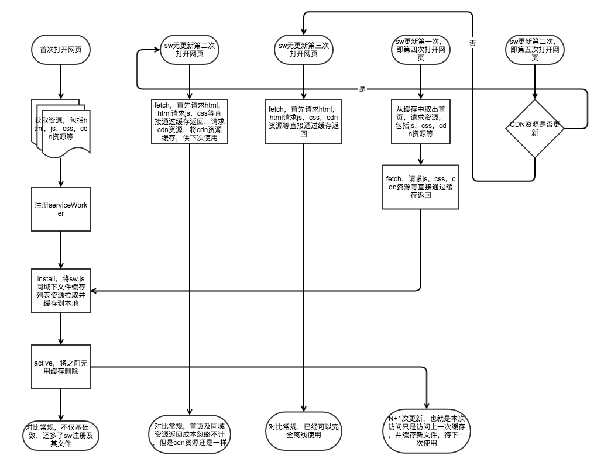

## pwa
### serviceWorker
[1.管辖范围](#1. 管辖范围)  
[2.注册文件（sw.js）](#2. 注册文件（sw.js）)  
[3.install失败问题](#3. install失败问题)  
[4.跨域，如缓存cdn问题如何把控](#4. 跨域，如缓存cdn问题如何把控)  
[5.sw更新后发生了什么？](#5. sw更新后发生了什么？)  
[6.caches是个啥？](#6. caches是个啥？)  
[7.clients是个啥？](#7. clients是个啥？)  
[8.通信方案](#8. 通信方案)  
[9.缓存方案](#9. 缓存方案)  
[拓展阅读](https://developer.mozilla.org/zh-CN/docs/Web/API/Service_Worker_API/Using_Service_Workers)
#### 1. 管辖范围  
serviceWorker注册文件只能管辖注册文件所在目录下所有文件  
#### 2. 注册文件（sw.js）  
注册文件主要是用来决定缓存策略的，并且该文件也不需要在html中加载，self为serviceWorker实例，由外部安装，内部监听事件，如

```JavaScript
// app.js
if ('servericeWorker' in navigator) {
  window.addEventListener('load', () => {
    navigator.servericeWorker.register('./sw.js')
      .then(reg => console.log('register successful'))
      .catch(err => console.log('err'))
  })
}

// sw.js
const cacheName = 'some-app'
const cacheFileList = [...] // some file list
// add cache list
self.addEventListener('install', event => {
  event.waitUntil(
    caches.open(cacheName)
      .then(cache => {
        return cache.addAll(catchFileList)
      }).then(e => {
        return self.skipWaiting()
      })
  )
})
// clean old cache
self.addEventListener('activate', event => {
  event.waitUntil(
    caches.keys().then(names => {
      return Promise.all(names.map(name => {
        if (name !== cacheName) {
          return caches.delete(name)
        }
      }))
    }).then(() => {
      clients.claim() // self.clients.claim()
    })
  )
})
// fetch resquest
self.addEventListener('fetch', event => {
  event.respondWith(
    caches.open(cacheName).then(cache => {
      return cache.match(event.request).then(response => {
        if (response) {
          return response
        } else {
          return fetch(event.request).then(response => response)
        }
      })
    })
  )
})
```

> 正因为未被引入到`html`中，`sw.js`是一个特殊的宿主环境，比如你不能使用`window`，因此宿主环境就是`self`，不同于`node`中的`global`与浏览器中的`window`  
注册的`serviceWorker`提供诸如`caches`等全局变量，`caches`就是`cacheStorage`  
那么意味着我们`code`时，可以适当省去`self`，如`self.caches === caches` `self.clients === clients`  
另外全局`this`指向`self`

整体参考：

#### 3. install失败问题
虽然当`install`失败在下一次加载页面，即使不更新`sw`，还是会重新尝试`install`，但是为了代码的健壮，并且尽快进入`active`状态还是应该做一些处理。我们可以将缓存资源分为较小、稳定的和较大、不稳定的。然后`waitUntil`也是异步操作，另外切记，检查返回是否合法，因此整体方案如下：

```JavaScript
self.addEventListener('install', e => {
  waitUnit(
    caches.open(cacheName).then(cache => {
      // some big or unstable
      bigList.forEach(file => {
        let request = fileToRequest(file)
        fetch(request)
          .then(res => {
            if (res.ok) {
              cache.put(request, res.clone())
            }
          })
      })
      // or cache.addAll(bigList)
      // some small or stable
      return Promise.all(smallList.map(file => {
        let request = fileToRequest(file)
        return fetch(request)
          .then(res => {
            if (res.ok) {
              return cache.put(request, res.clone())
            }
          })
      }))
    }).then(() => {
      self.skipWaiting()
    })
  )
})
```

> 关于`skipWaiting`，在`sw`第一次被注册时即使不执行`skipWaiting`也会触发`active`事件，但是更新`sw`文件后第二次加载就不会。`skipWaiting`即跳过本状态

#### 4. 跨域，如缓存cdn问题如何把控
既然`fetch`事件能拦截一切网络请求，也就意味着，我们可以在`fetch`中缓存`cdn`资源

```JavaScript
self.addEventListener('fetch', event => {
  event.respondWith(
    caches.open(cacheName).then(cache => {
      return cache.match(event.request).then(res => {
        if (res) {
          return res
        } else {
          fetch(event.request).then(res => {
            if (cdnList.find(item => event.request.url.indexOf(item) > -1) && res.ok) {
              cache.put(event.request, res.clone())
            }
            return res
          })
        }
      })
    })
  )
})
```

#### 5. sw更新后发生了什么？
首先我们知道一旦请求被`caches`缓存了，并且在`fetch`中处理为缓存策略，那么再次请求会直接返回缓存的文件。如果`sw`更新了就会触发新的`sw`一系列事件周期，如`install`等，但很不幸，刚刚的请求是由‘前任’处理的，因此此时页面还是上一次的，但是再次加载就会返回新的缓存。因此更新`sw`只是’现任取代‘前任’而已。  
说到这，还是再提一下`self.skipWaiting()`,执行才会使新的`fetch`及`activate`事件更新，否则`install`会一直处于挂起状态，而不会更新其他事件  
另外就是`clients.cliam()`方法，这个其实是用来告诉客户端，新的`sw`已经上位了，客户端可以监听相关事件然后刷新页面，所以可以做到当次更新，而不是N+1次更新，但是有一个问题，如何确定客户端当前页面不是缓存中取出来的？

1. `sw`在`fetch`时`postMessage`及客户端监听`controllerchange`事件去决定是否刷新页面。这种比较笨
2. 直接判断`navigator.serviceWorker.controller`是否存在，并确认触发了`controllerchange`事件

```JavaScript
navigator.serviceWorker.register('./sw.js').then(reg => {
  if (navigator.serviceWorker.controller) {
    navigator.serviceWorker.addEventListener('controllerchange', e => {
      location.reload()
    })
  }
})
```

#### 6. caches是个啥？
`caches`对应了`cacheStorage`，所有方法均返回一个`Promise`，并且都不需要`reject`，提供以下方法：
1. `caches.match(request[, options])` 返回一个`Promise`，参数为某个`cache`匹配到的请求的响应
2. `caches.open(name)` 返回匹配到`name`的`cache`，如果`cache`不存在则创建一个并返回
3. `caches.delete(name)` 删除某个`cache`，`resolve`参数为`Boolean`，成功则为`true`
4. `caches.has(name)` `resolve`参数为`Boolean`
5. `caches.keys()` `resolve`参数为`cacheName`组成的数组

##### cache
大概你现在应该能理解`cache`，类似数据库，这个就是`table`，同样，`cache`提供的方法也都是异步的
1. `cache.match(request[, options])` `resolve`参数为`response`，如果不存在则为`null`
2. `cache.add(request)` //request is Resquest Object or file url，拉取某个资源添加缓存
3. `cache.addAll(requestList)` 拉取多个资源，添加多个缓存
4. `cache.put(request, response)` 添加缓存
5. `cache.delete(request[, options])` 删除某个缓存，同样`resolve`参数为`Boolean`
6. `cache.keys()` 返回缓存key列表，注意，key为请求，值为响应

那么问题来了，什么是`options`，`cache.add`与`cache.put`有什么区别？  
**什么是`options`**  

```JavaScript
{
  ignoreSearch: Boolean, // default false 忽略URL search部分
  ignoreMethod: Boolean, // default false 忽略请求方法
  ignoreVary: Boolean, // default false 忽略Vary头部
  cacheName: String // 默认忽略
}
```

**`cache.add`与`cache.put`有什么区别**  
前者是拉取并缓存起来，后者则是将请求和响应缓存起来

#### 7. clients是个啥？
`clients`对于`sw`而言就是客户端列表，项可以是`window`,`worker`,或`sharedworker`，提供以下方法：
1. `clients.matchAll()` 返回`Promise`，`resolve`参数为`client`列表
2. `clients.get(id)` 返回`Promise`，`resolve`参数为某个`client`
3. `clients.claim()` 不解释
4. `clients.openWindow(url)` 为浏览器客户端打开一个新窗口，返回`Promise`，`resolve`为新窗口`WindowClient`

##### client
同样，`client`为具体`client`，可以为`window`，`worker`，`shareworker`，提供以下属性和方法：
1. `client.id`
2. `client.type` value is window，worker，shareworker
3. `client.url`
4. `client.postMessage()`

至于`windowClient`就是`client`子集，但[提供了额外的属性和方法](https://developer.mozilla.org/zh-CN/docs/Web/API/WindowClient)

#### 8. 通信方案
除了使用`clients.claim()`触发客户端`controllerchange`事件外，还可以使用`client.postMessage`完成sw与客户端通信，使用`navigator.serviceWorker.controller.postMessage`完成客户端与sw通信，具体如下：

```JavaScript
// app.js
if ('serviceWorker' in navigator) {
  function postMessage (msg) {
    if (navigator.serviceWorker.controller) {
      navigator.serviceWorker.controller.postMessage(msg)
    }
  }
  navigator.serviceWorker.register('./sw.js')
    .then(resgister => {
      navigator.serviceWorker.addEventListener('message', (event) => {
        console.log(event.data, 'message from sw')
      })
      setTimeout(postMessage, 500, 'message from browser')
    })
}

// sw.js
self.addEventListener('message', event => {
  console.log(event.data, 'message from app')
  clients.matchAll().then(clients => {
    clients.forEach(client => {
      client.postMessage('message from sw')
    })
  })
})

```

> 注，因为首次注册时在客户端可能还不存在`navigator.serviceWorker.controller`

#### 9. 缓存方案
缓存方案是`serviceWorker`存在的意义。  
有几个需要思考的问题

1. 缓存什么？
2. 如何处理？
3. 如何健壮？

**缓存什么？**  
一般而言我们可以将资源分为静态资源和动态资源。通常我们把文件归为静态资源，`json`归为动态资源，但是我们可能在`json`中包含静态资源，如，在一个获取用户信息的接口中返回用户头像`url`，如果我们仅按照类型去决定是否缓存会有一定问题。  
当然基本的套路是缓存本地完全静态文件和`cdn`资源即可，`ajax`缓存`get`请求，但是每次`ajax`请求还是去请求最新的，除非在弱网和离线状态下才返回缓存  

**如何处理？**  
1. 尽量避免使用`cache.addAll`，虽然在请求失败，刷新页面后依旧会重新安装，但是这也会使得其他的资源也重新下载、缓存
2. 除了在`install`中进行缓存，还应该在`fetch`中进行缓存，如cdn缓存
3. 缓存了记得返回回去
4. 在使用`cache.put`时切记检查其合法性，否则会一直404

**如何健壮？**  
其实上面两点已经讲了很多，至于如何健壮想必你已经有自己的想法了。简单讲一下个人认为比较通用、实用的策略
1. 建立三张`cache`表，分别缓存静态文件（本地文件及CDN），`ajax get`请求，`ajax`衍生的静态文件，如用户头像
2. 缓存一定要验证资源是可用的，即`response` `status`为200或300-304状态或`ok`为`true`
3. 如果缓存满了，优先删除后面两张`cache`表，根据场景确定后两张表删除的优先级
4. 对于`ajax get`请求，优先请求，当返回超时或其他原因，包括弱网或离线等，再返回缓存，建议篡改response，以便客户端处理
5. 对于`ajax get`引发的静态资源请求，优先缓存，但是这也意味着如果这种资源较多并且更换频繁，可能导致大量不必要缓存，从而导致缓存溢出，所以具体还是看场景吧，建议可以把这部分需要缓存的静态资源加上标识符，如`query`
6. 细粒度更新，静态缓存表我们可以加一个版本号，在`install`时检查版本号是否一致，一致不更新，在`activate`清除缓存时也检查一次。当然更变态的方式是`diff`增量更新
